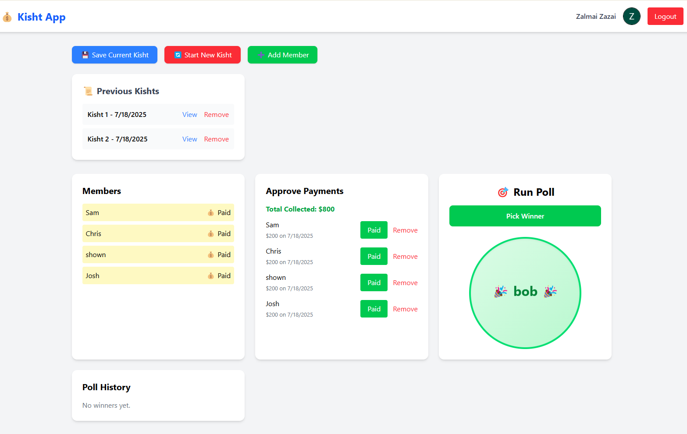
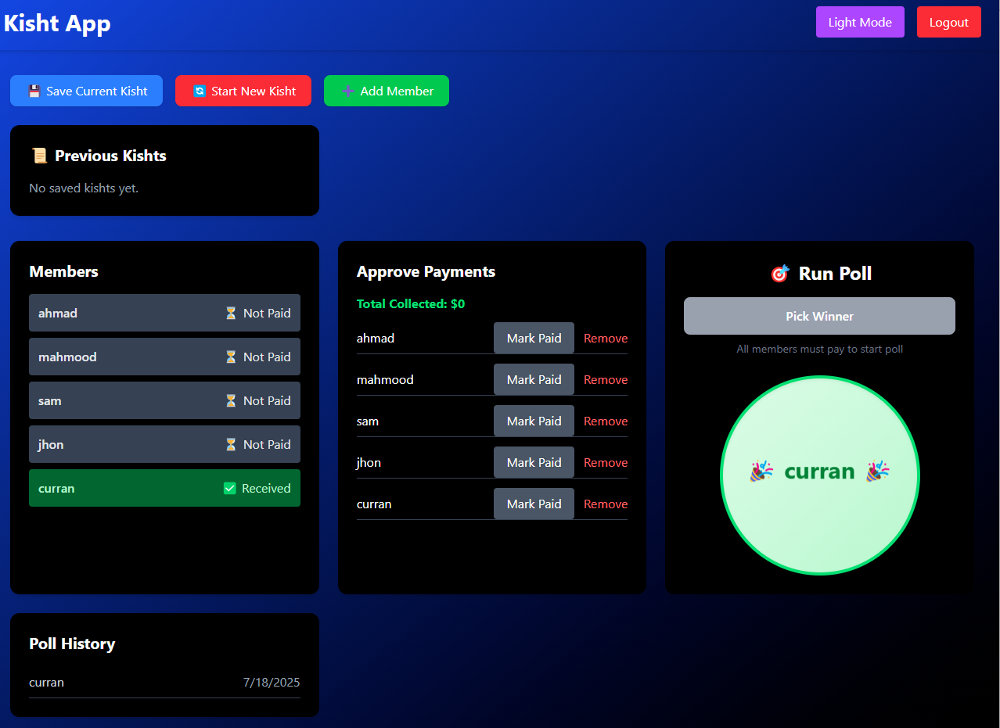
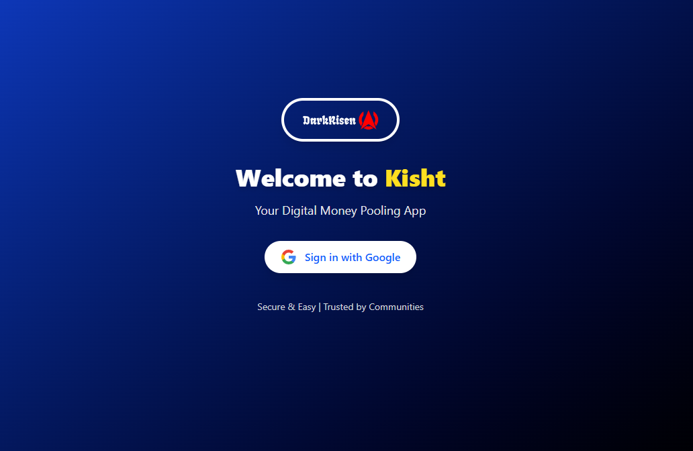
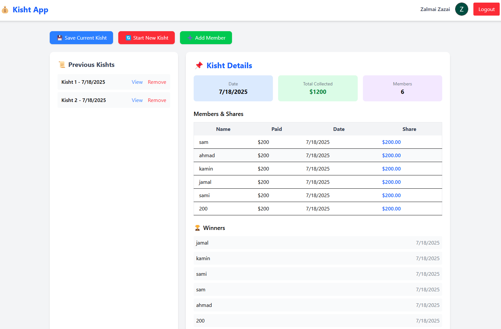

# 📦 Kisht App

**Kisht** is a Pashto word meaning **installment-based contribution**. This app is a digital version of the traditional money-pooling system where a group of people contributes a fixed amount periodically, and one member receives the total in each cycle through a random poll. The process continues until all members have received their share.

---

## ✅ Features

### 🔐 Authentication

- Google Sign-In using **Firebase Auth**.
- Only **Admin** can manage group settings and approve payments.

### 👥 Member Management

- Create a **Kisht group** and add members.
- Track:
  - Amount paid by each member.
  - Total amount collected.
- Admin can **remove members** before the first payment starts.
- Adding new members is **disabled after payments begin**.

### 💰 Contribution Tracking

- Each member has:
  - Paid status
  - Paid amount
  - Date of payment
- Displays **total collected amount** dynamically.

### 🎯 Poll & Winner Selection

- Poll button becomes active **only when all members have paid**.
- Spins an **animated wheel** and randomly selects the winner.
- Confetti animation on winner announcement (disappears after 3s).
- Marks winner as `received: true`.

### 🔄 Cycle Management

- After each cycle:
  - **Reset payment statuses** for next cycle.
  - Continue until all members have received their share.
- When all members have received, **Kisht is completed**.

### 📜 History & Saved Kishts

- Track winners and dates for each cycle.
- Save completed Kishts and **view details anytime**:
  - Date
  - Members & their contributions
  - Winners list with dates
  - Each member’s share
- Remove old Kisht records when needed.

### 🖥️ Beautiful UI

- Built with **React + Vite + TailwindCSS**.
- Responsive and mobile-friendly.
- Smooth animations with Tailwind and `react-confetti`.

---

## 🛠️ Tech Stack

- **Frontend:** React, Vite, Tailwind CSS
- **Authentication:** Firebase Auth (Google Sign-In)
- **State Management:** React Hooks + LocalStorage
- **Animations:** Tailwind CSS Animations + react-confetti

---

## 🚀 How to Run the App

```bash
# Clone the repository
git clone https://github.com/Zalmai-zazai/kisht-app.git

# Navigate to the project
cd kisht-app

# Install dependencies
npm install

# Add your Firebase config in src/firebase.js

# Run the app
npm run dev
```

---

## 📌 Future Enhancements

- Firebase Firestore integration for real-time updates.
- Role-based access (Admin vs Members).
- Push notifications for cycle updates.
- Multi-language support (Pashto & English).

---

## 📷 Screenshots

### Dashboard




### Login & Winner Animation



### Previous Kisht Details



---

### ✨ Live Demo

_(Add link when deployed)_

---

### 📄 License

This project is open-source and available under the MIT License.
